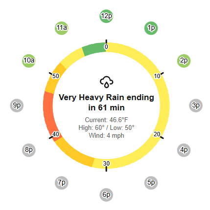

# Precipitation Radial Card

A custom Home Assistant integration that displays a clock-style radial precipitation forecast using [PirateWeather](https://pirateweather.net/) data.

[](https://github.com/hacs/integration)



The inner ring shows **minutely** precipitation intensity for the next 60 minutes. The outer ring shows **hourly** forecasts for the next 12 hours. The center displays current conditions, temperature, high/low, and wind speed.

## Features

- Clock-style radial visualization of precipitation forecasts
- Minutely precipitation ring (next 60 minutes)
- Hourly precipitation ring (next 12 hours)
- Current conditions with feels-like temperature, high/low, and wind speed
- Smart precipitation summaries ("Light Rain starting in 12 min, for 8 min")
- Auto-discovers entities — zero card configuration needed
- Configurable polling intervals (minutely and hourly, independently)
- Configurable location (latitude/longitude) — changeable anytime without reinstalling
- Responsive design using CSS container queries
- Color-coded intensity scale from green (light) to red (heavy)

## Installation

### HACS (Custom Repository)

1. Open HACS in Home Assistant
2. Click the three dots menu (top right) > **Custom repositories**
3. Add `https://github.com/philrenda/precipitation-radial-card` with category **Integration**
4. Click **Download**
5. Restart Home Assistant

### Manual

1. Copy the `custom_components/precipitation_radial` folder to your Home Assistant `config/custom_components/` directory
2. Restart Home Assistant

## Setup

1. Go to **Settings** > **Devices & Services** > **Add Integration**
2. Search for **Precipitation Radial Card**
3. Enter your PirateWeather API key and location
   - Get a free API key at [pirate-weather.apiable.io](https://pirate-weather.apiable.io/)
   - Latitude/longitude use decimal degrees (e.g. `40.712`, `-74.006`)
   - 3 decimal places is sufficient — PirateWeather resolves to a 13 km grid
4. The card and all 6 sensors are created automatically

### Adding the Card to a Dashboard

1. Edit your dashboard
2. **Add Card** > search for **Precipitation Radial Card**
3. The card auto-discovers its entities — no configuration needed

You can also manually specify entities in YAML if preferred:

```yaml
type: custom:precipitation-radial-card
entity_minutely: sensor.precipitation_radial_minutely_forecast
entity_hourly: sensor.precipitation_radial_hourly_forecast
entity_current_temperature: sensor.precipitation_radial_current_apparent_temperature
entity_high_temperature: sensor.precipitation_radial_today_high_temperature
entity_low_temperature: sensor.precipitation_radial_today_low_temperature
entity_wind_speed: sensor.precipitation_radial_current_wind_speed
```

## Configuration

All settings can be changed after installation — no need to remove and re-add the integration.

Go to **Settings** > **Devices & Services** > **Precipitation Radial Card** > **Configure** to change:

- **Latitude / Longitude** — change your forecast location
- **Minutely update interval** — how often to fetch minute-by-minute precipitation (default: 600 seconds)
- **Hourly update interval** — how often to fetch the hourly forecast (default: 1800 seconds)

Changes take effect immediately (the integration reloads automatically).

## API Usage & Recommended Intervals

The integration makes **2 API calls per update cycle** — one for minutely data, one for hourly data. Each Home Assistant restart also triggers a fetch for both.

[PirateWeather](https://pirate-weather.apiable.io/) tiers:
- **Free:** 10,000 calls/month
- **$2/mo donor:** 20,000 calls/month

| Minutely | Hourly | Calls/Month | Free (10k) | $2/mo (20k) |
|----------|--------|-------------|------------|--------------|
| 900s | 3600s | ~3,600 | Very safe | Very safe |
| **600s** | **1800s** | **~5,760** | **Comfortable (default)** | **Very safe** |
| 300s | 1200s | ~10,800 | Tight | Comfortable |
| 180s | 900s | ~17,280 | Exceeds | Comfortable |

**Formula:** `calls/month = ((86400 / minutely_seconds) + (86400 / hourly_seconds)) x 30`

## How the Card Works

The card uses a clock-style layout with two concentric rings and a center info panel.

### Inner Ring — Next 60 Minutes

The inner ring represents the next 60 minutes of precipitation, one segment per minute, arranged like a clock face. The **top (12 o'clock position) is now**, and time advances clockwise — so the right side is +15 minutes, the bottom is +30 minutes, and the left side is +45 minutes. Tick marks at every 10 minutes help you read the timeline.

This data comes from PirateWeather's **minutely nowcast**, which is based on radar extrapolation. Each segment is colored by precipitation intensity:

| Color | Intensity (in/hr) |
|-------|-------------------|
| Gray | None / negligible |
| Light green | < 0.05 (drizzle) |
| Green | 0.05 – 0.15 (light rain) |
| Yellow | 0.15 – 0.30 (moderate) |
| Orange | 0.30 – 0.60 (heavy) |
| Red-orange | 0.60 – 1.0 (very heavy) |
| Red | > 1.0 (extreme) |

### Outer Ring — Next 12 Hours

The outer dots represent the next 12 hours of precipitation forecast, positioned like hours on a clock face. Each dot is placed at its **actual clock hour** — so if it's currently 2 PM, the first dot appears at the 2 o'clock position, the next at 3, and so on around the dial.

This data comes from PirateWeather's **hourly forecast**, using the same color scale as the inner ring.

### Center Text

The center displays a weather icon, a summary line, and current conditions (temperature, high/low, wind). The summary line adapts based on what the minutely data shows:

- **No precipitation:** Shows the current hourly condition (e.g., "Partly Cloudy")
- **Rain starting soon:** "Light Rain starting in 12 min, for 8 min"
- **Currently raining:** "Moderate Rain ending in 23 min" or "Heavy Rain ongoing"

### Data Sources & Limitations

All data comes from the [PirateWeather API](https://pirateweather.net/), which is a free alternative to the Dark Sky API.

**Minutely data (inner ring)** is a radar-based nowcast. It's generally reliable for detecting precipitation that's already nearby, but has some limitations:

- **Radar extrapolation can miss new storm formation** — it projects existing precipitation forward but can't predict rain that develops from scratch
- **Accuracy decreases with time** — the first 15–20 minutes are usually reliable, but the 30–60 minute range is more speculative
- **Light precipitation may not register** — very light drizzle or mist can fall below radar detection thresholds
- **Resolution is coarse** — PirateWeather uses a ~13 km grid, so localized showers may be missed or shown for nearby areas

**Hourly data (outer ring)** is a traditional forecast model, which is better at predicting precipitation hours out but less precise about exact timing and intensity.

Both `precipIntensity` (in/hr) and `precipProbability` (0–1) must exceed minimum thresholds for a segment to show color. A segment with high intensity but very low probability (< 10%) will remain gray, and vice versa.

## Sensors Created

The integration creates a **Precipitation Radial** device with 6 sensors:

| Sensor | Description | Unit |
|--------|-------------|------|
| Minutely Forecast | Minute-by-minute precipitation data (next 61 minutes) | — (data in attributes) |
| Hourly Forecast | Hourly forecast data (next 24 hours) | — (data in attributes) |
| Current Apparent Temperature | Feels-like temperature | °C (auto-converts to your HA unit system) |
| Today High Temperature | Today's high from hourly forecast | °C (auto-converts) |
| Today Low Temperature | Today's low from hourly forecast | °C (auto-converts) |
| Current Wind Speed | Current wind speed | m/s (auto-converts) |

## License

MIT
